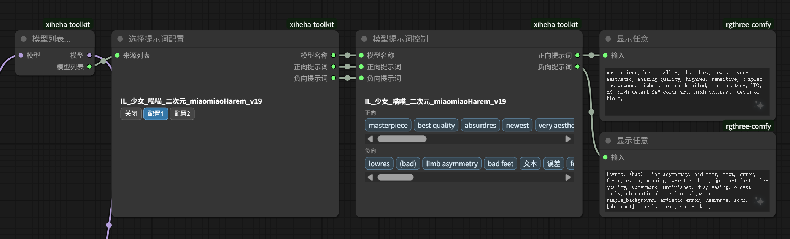

# ComfyUI-xiheha-toolkit

ComfyUI 自定义节点**工具库**（`xiheha-工具箱`），包含「模型来源提示词配置」与「视频智能分割」等功能模块：读取和编辑模型 / LoRA 同目录 sidecar 的 TXT/JSON 提示词配置，支持来源采集、配置选择、词条开关预览、提示词合并与展示；以及基于场景检测与多策略时间窗口的智能视频分割。

## 节点

| 节点 | 说明 |
| --- | --- |
| 模型列表获取 | 透传 `MODEL`，输出模型来源列表 |
| easy-use兼容_模型列表获取 | 透传 easy-use `LORA_STACK`，输出模型列表 |
| 选择提示词配置 | 扫描 sidecar 配置，选择正向/负向提示词 |
| 模型提示词控制 | 按词条启用/关闭提示词，实时预览；不同配置分别记忆开关状态 |
| 提示词合并 | 按端口顺序合并最多四段提示词 |
| 显示提示词 | 分别显示连接到正向/负向端口的提示词，并透传两个输出 |
| 编辑提示词配置 | 按模型编辑、新增并保存正向/负向 sidecar 配置 |
| 智能视频分割器 | 结合场景检测与时间窗口智能切分长视频为多片段，生成元数据流与音频 |

### 智能视频分割检测模式

「智能视频分割器」提供三种分段模式：

| 分段模式 | 时长参数 | 切点规则 |
| --- | --- | --- |
| 目标（默认） | 最短、目标、最长 | 在合法可靠切点中选择距离目标时长最近的位置；没有候选时按目标时长兜底 |
| 模糊 | 最短、最长 | 达到最短时长后遇到第一个可靠切镜点就切；没有候选时在最长时长兜底 |
| 精确 | 目标 | 不运行场景检测，严格按目标时长切片 |

“目标”和“模糊”模式可选择三种检测策略：

| 检测模式 | 适用场景 | 特点 |
| --- | --- | --- |
| 智能自适应检测（推荐） | 剧情、混剪和一般短视频 | 识别硬切、淡入淡出和明显叠化；只在疑难候选附近使用光流运动补偿 |
| 快速内容检测 | 固定机位、访谈和长视频批处理 | 不计算光流，速度优先；快速运镜时可能产生误判 |
| 高运动抑制检测 | 手持、运动、舞蹈及频繁推拉摇移 | 更积极检查运动一致性，降低运镜误切，分析耗时较高 |

`灵敏度` 越高越容易保留较弱转场；`切镜阈值` 越高越保守；`突变显著度` 越高越能过滤闪光、抖动和连续运动。“目标”模式中切镜强度只在候选与目标距离相同时决胜；“模糊”模式完全不使用目标时长。

“目标”和“模糊”分段都会在正常窗口后额外前瞻一个“最短时长”窗口；当可靠转场即将落入下一段开头的禁区时，会适当前移上一刀，使转场成为下一段边界，同时继续遵守最短与最长时长。

切片导出以检测得到的整数帧区间为准：`start_frame` 是片段首帧，`end_frame` 不包含在当前片段中。界面显示的三位小数时间仅用于阅读，不参与 FFmpeg 寻址，避免循环小数帧时刻导致首帧跳过、重复或把下一镜头带入尾帧。视频与音频分别使用帧级 `trim` 和采样级 `atrim` 收尾，防止 AAC 最后一个编码块因视频先结束而丢失。

0.9.0 已移除旧版六个算法枚举。旧工作流需要在节点中重新选择上述检测模式，否则会收到明确的旧算法错误提示。

分段模式内部值也已统一为 `target` / `fuzzy` / `exact`，不迁移旧值。历史工作流原有的 `fuzzy` 会表示新的“模糊”模式；若希望保持原来的目标邻近切分，请重新选择“目标”。

## 效果预览



## 安装

```bash
cd ComfyUI/custom_nodes
git clone https://github.com/xiheha3213906313/ComfyUI-xiheha-toolkit.git
```

重启 ComfyUI 并刷新浏览器页面。

## 配置格式

在模型 / LoRA 同目录放置同名 TXT 或 JSON 文件，按以下顺序查找：`模型名.txt`、`模型名.json`、`模型名.safetensors.json`、`模型名.safetensors.txt`。

```text
正向：anime face, realistic hair,
负向：lowres, watermark,
正向2：another style,
负向2：bad anatomy,
```

「编辑提示词配置」会将已有配置写回原 sidecar 文件；模型尚无配置文件时，新建同目录的 `模型名.txt`。修改内容会先暂存在节点中，带星号的配置在点击「保存」后统一写入。

详细开发规范见 `AGENTS.md`。
